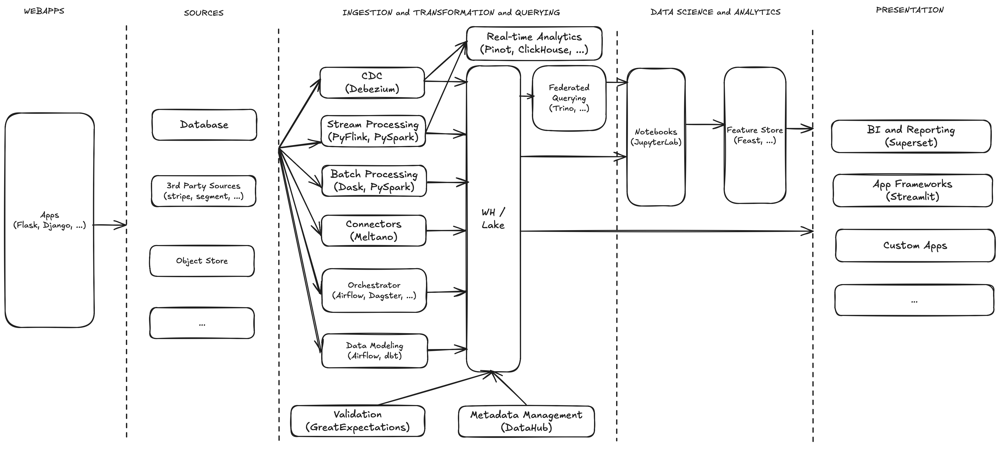

I'm going to make a suggestion -- you can build most SaaS startups with Python.  

As the SaaS ecosystem continues to grow, you'll find products that cater to a variety of different use cases; from health and fitness to meeting and scheduling. Yet despite the myriad use cases out there, most of the SaaS startups have a similar architecture. There's a webapp or a mobile app which the users interact with, and databases which store their data. From there, the data is used for a variety of different purposes like deriving insights through analytical queries, or performing something more involved using statistical or machine learning models. Finally, these insights are then presented to the users within the application and to the internal stakeholders as reports and dashboards, or used to perform data-driven tasks such as provide recommendations or augment the user's experience of the product.  

The technology stacks of the startups tend to be varied, too. Every language brings with itself an ecosystem of tools and libraries. These could be libraries for creating webapps, intreacting with databases, performing asynchronous tasks, analysing data, and so on. Some languages, over the years, have solidified their position as being the defacto at a particular task. Yet despite all of this, I'll suggest that Python and it's ecosystem is well-suited for most of what a SaaS startup needs.  

Let's begin by looking at the blueprint of a SaaS startup, from left to right.  

## Blueprint

 

The user interacts with the software through it's application. This could be a website, a mobile app, or a wearable device. If you're building a mobile app or a wearable device, you may use a language that's native to that platform. In the case of a website, however, you have a variety of different options depending on what language you choose to build it with.  

If you're using Python, you have the option of choosing from among Flask, Django, or FastAPI. All three of these provide you with the capability to design fully-functioning websites. Django is a fully-featured framework with its own rendering engine and ORM. Flask and FastAPI are, on the other hand, libraries which allow you to pick and choose other libraries for relevant functionality. The Python ecosystem has matured libraries for common tasks such as SQLAlchemy and Peewee for interacting with databases, Jinja2 for templating, and so on. These can then be combined with Flask and FastAPI to build a fully-featured website.  

The data from the applications can land in a variety of different places. It can end up in databases, in object stores, or with third-party service providers such as payment processors. Being able to access and query this data is what allows us to derive insights from it. The next step, thus, is to move this data into a system from where it can be queried and analysed. 

Let's move a step to the right and look at moving data. 

Data from OLTP stores can be moved into a warehouse or a data lake either in real-time or in batches. If we were to move this data in real-time we'd rely on a framework like Debezium to read data from the database and write it to Kafka. This is an instance where a language such as Java is the standard; the Kafka and the surrounding ecosystem is written in Java. This change data could then be ingested into a data lake or a warehouse such as Snowflake, Redshift, Doris, etc.  

If we were to process the stream of data coming from the capture of change data or from another stream written to Kafka, we could rely on a stream processing framework like Spark or Flink. While also written in Java, they provide a Python API which can be used for performing computation.  

If we were to process data in batches, perhaps from logs written to an object store, we could use Spark or Dask. As mentioned before, Spark provides a Python API. Dask, in contrast, is written purely in Python. You can achieve most of what you could with Spark with Dask. Additionally, Dask also allows natively scaling machine learning models from sklearn, xgboost, and others.  

A tool like Meltano allows moving data from third party sources like payment processors and customer data platforms into a database or a data warehouse. Written in Python, it's a declarative framework for moving data from sources to destinations. With a number of community-provided sources and destinations, Meltano makes it easier to move data. If a source or a destination is missing, some Python code would need to be written to add it. 

Orchestrators like Airflow, Dagster, and Prefect make it possible to create complex workflows. These workflows could involve creating and transforming datasets, training machine learning models, emailing reports, and other similar things. All three of them are open-source, written in Python, and require creating workflows in Python.  

Data modeling tools like DBT and Airflow's SQLExecuteQueryOperator allow creating data models using SQL. Usually, DBT and Airflow are used in conjunction with each other to create or update models periodically.  

Libraries like GreatExpectations allow writing complex data validation checks using Python. It's also used in conjunction with Airflow to peridocially check the validity of the datasets once they are created.  

As workflows are orchestrated and new datasets are created from existing ones, their lineage can be pushed to a metadata management tool like DataHub. Written in a combination of Java and Python, it allows automatically capturing the lineage of datasets as they are transformed by running various queries.  

We'll look to two final pieces of infrastructure in the technology stack that are crucial but written in languages other than Python. The first is a real-time analytics database which allows running queries on data as it is generated. This includes databases like Clickhouse, Pinot, and others. The second is a federated querying engine like Presto or Trino which allows querying multiple data sources together in a single SQL query. Since these are written in languages like C++ or Java, you'll only require operational capability to deploy and monitor them. You may also opt for a hosted version to reduce the operational overhead.  

So far the technology stack is written or built using Python with a few essential pieces written in other languages. We'll now step to the right and look at an area where Python is the defacto language -- data science.  

Notebook servers like JupyterLab allow writing Python code for exploratory data analysis or creating the first iteration of machine learning models. Analysis is done using libraries like Pandas, Matplotlib, Seaborn, among others. Machine learning and deep learning models are created using libraries like sklearn, xgboost, PyTorch, etc. Once the analysis is complete, the adhoc code is cleaned up and made part of a workflow that's orchestrated on a schedule. The features that are generated in the process are written to a feature store like Feast and later used in data-driven tasks like making predictions and providing recommendations.  

The final piece of the architecture is to deliver these insights, recommendations, and experiences back to the user or to provide reports to relevant stakeholders.   

Insights, recommendations, and experiences are delivered to the users by creating APIs that serve them. These can be created using Flask, Django, or FastAPI. Data-driven apps can be created using low-code frameworks like Streamlit which require writing some Python glue code to fetch and display the data. Finally, reports can be served to the business users internal to the organisation using a BI tool like Superset, also written in Python.  

This leaves us with a simple question: why use Python for everything?  

## Why  

There are a couple of reasons for choosing Python.  

The first reason is the simplicity of the language. Python is an elegant language that's easy to get started with.  

The second reason is productivity. If most of the systems are in Python, the engineers operate in a familiar environment. This allows engineers to contribute to projects while operating within the realm of the Python ecosystem. This reduces the context switch required to be productive and allows developing deep generalization within the language, its tooling, and its best practices. In a startup, especially in its early days, most engineers wear multiple hats and being able to deploy and ship quickly with confidence is an advantage.  

There is, however, a more subtle reason for "standardizing" around Python that I derive from the theory of economics.[1] In his book "The Wealth of Nations", Adam Smith writes that the increase in wealth lies in the increase in productivity through greater division of labor. He opines that this increases productivity in three ways. First, by repeating the same processes many times, workers become good at what they do more quickly. In other words, practice makes perfect. Second, specialization reduces the context switch required to get productive. Finally, breaking down tasks into smaller processes makes each step easier to be automated.  

Let's look at the three reasons in the context of software engineering, especially with using Python.  

First, "repeating" the same tasks like writing webapps, data pipelines, and so on using Python allows engineers to develop more proficiency in the language. This practice allows them to write idiomatic and performant code that's easier to read and maintain. The result of this are systems that are simpler and run more reliably.  

Second, being in the familiar ecosystem reduces the context switch required to become productive. This is because the skills acquired from using the language are applicable to a variety of different tasks. This "carry over" effect compounds with time. As engineers become more and more proficient with the language, the context switch becomes smaller and smaller.  

Finally, using Python as much as possible allows creating standardized automations for routine tasks like deployment, vulnerability checks, and so on. An example of this would be to scan all webapps for vulnerabilities in the build pipeline. Since they're all built similarly using the same language and ecosystem, the same automation can be used for the scan. This allows reusing the automations and reduces the operational overhead, too.  

Finito.